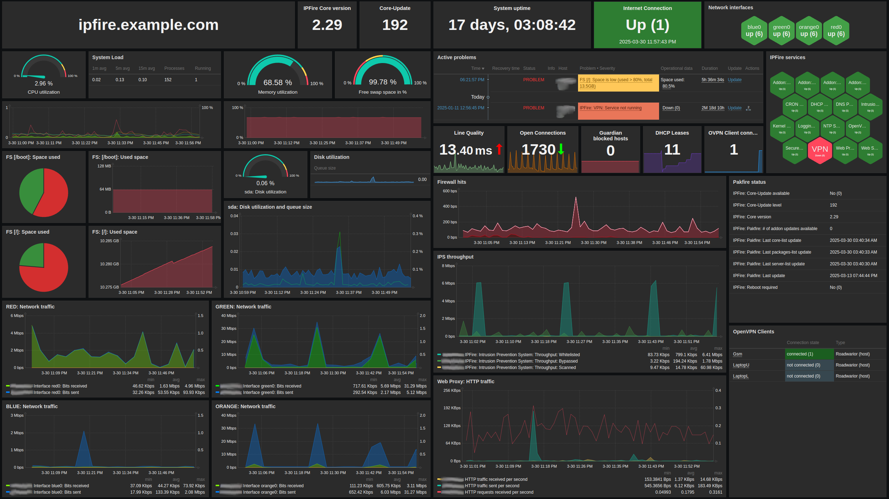

# IPFire by Zabbix Agent Active

## Description

This template monitors an [IPFire](https://www.ipfire.org/) [appliance](https://www.lightningwirelabs.com/products/ipfire/appliances) or [instance](https://www.ipfire.org/download)

## Overview

For Zabbix version: [6.0](./6.0/), [6.4](./6.4/), [7.0](./7.0/)

Supports monitoring of:
- IPFire general stats (Number of current DHCPd clients)
- IPFire services (default IPFire services and possible Addon services)
- Pakfire status (Installed version, Available update(s))
- Network stats (Line quality, Open Connections, Firewall hits)
- OpenVPN clients and stats (OpenVPN client discovery, OpenVPN client properties, Traffic stats, Client/Server/CA Certificate validation)

Use in conjunction with a default Template OS Linux-template for CPU/Memory/Storage monitoring of the IPFire appliance/instance.

This template was created for:

- IPFire 2.29 - Core update 189

**Warning**: This template will *NOT* work on earlier versions of IPFire due to changes to the Zabbix Agent addon.

*Example Zabbix 7.0 dashboard for an IPFire instance using this template + Zabbix default Linux by Zabbix Agent template*

## Author

Robin Roevens
